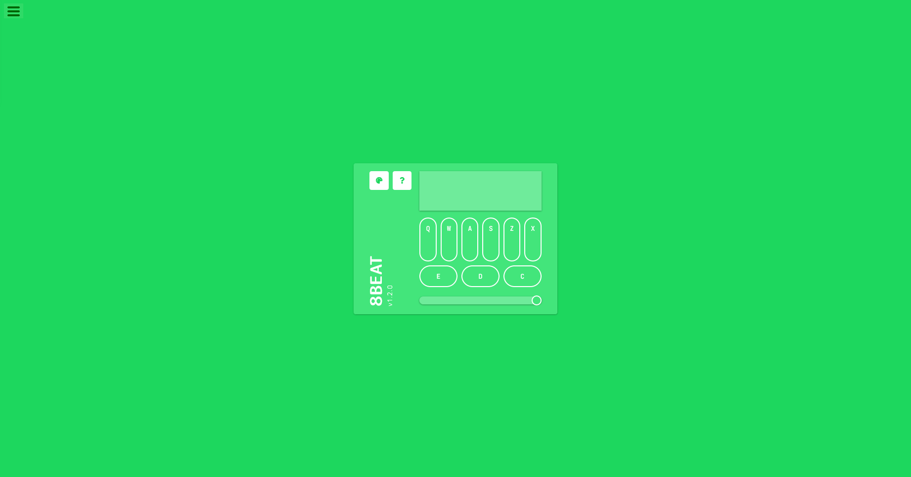
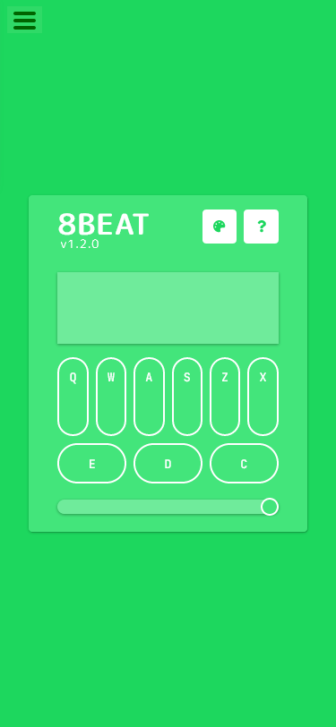

# Drum Machine

The following application is a simple 8-bit drum machine built with [TypeScript](https://www.typescriptlang.org/), [Parcel](https://parceljs.org/), [Sass](https://sass-lang.com/) and [ReactJS](https://reactjs.org/).

## Motivation

This project was made for the [Front End Development Libraries Certification on Free Code Camp](https://www.freecodecamp.org/learn/front-end-libraries/front-end-libraries-projects/build-a-drum-machine).

## Table of contents

-   [Overview](#overview)
    -   [The challenge](#the-challenge)
    -   [Screenshot](#screenshot)
    -   [Links](#links)
    -   [Features](#features)
-   [Getting started](#getting-started)
    -   [Prerequisites](#prerequisites)
    -   [Installation](#installation)
    -   [Built with](#built-with)
    -   [License](#license)
-   [Author](#author)
-   [Acknowledgments](#acknowledgments)

## Overview

### The challenge

Users should be able to:

-   [x] View the optimal layout depending on their device's screen size

-   [x] Contain clickable "drum pads"

-   [x] Trigger audio clips upon clicking or hitting the corresponding keystrokes shown on the "drum pads".

-   [x] Display the name of the audio clip when triggered.

-   [x] Change the volume of the drum machine

-   [ ] Give the user the option to swap between different themes

-   [x] Show a modal explaining the application when clicking the "help" button

### Screenshot

**Desktop View**



**Mobile View**



### Links

-   Project URL: [Github Repository](https://github.com/N-Nikolaev/drum-machine)
-   Live App URL: [Github Page](https://n-nikolaev.github.io/drum-machine)

### Features

This project was based on the sample project provided by Free Code Camp as an example output and has a number of additional features to distinguish itself from the provided sample output, these include:

-   The design was based off of designs made by [Tom Piggott](https://dribbble.com/tompiggott) and [Nikonov Dmitry](https://dribbble.com/mozdock).
-   The application was built from scratch using ReactJS
-   Utilizies TypeScript for type checking.
-   Parcel was used to bundle all the files to reduce file size
-   ~~Has light and dark mode theming~~
-   And is mobile responsive

## Getting started

### Prerequisites

You are going to need the latest version of NPM in order to install this project on your machine.

-   npm
    ```sh
    npm install npm@latest -g
    ```

### Installation

1. Clone the repository
    ```sh
    git clone https://github.com/N-Nikolaev/drum-machine.git
    ```
2. Install NPM packages
    ```sh
    npm install
    ```

### Built with

-   Semantic HTML5 markup
-   CSS custom properties
-   CSS Grid
-   Mobile-first workflow
-   [SASS](https://sass-lang.com/) - CSS Preprocessor
-   [Parcel](https://parceljs.org/) - Web Application Bundler
-   [TypeScript](https://www.typescriptlang.org/) - Static Typing Language
-   [ReactJS](https://reactjs.org/) - JavaScript Library / Framework
-   [FontAwesome](https://fontawesome.com/) - Icon toolkit
-   [Sample Swap](https://sampleswap.org/) - Royalty Free Sound Clips
-   [Favicon.io](https://favicon.io/) - Favicon generator

### License

Distributed under the MIT License. See `LICENSE` for more information.

### Useful resources

1. [FCC - Drum Machine Example Project](https://codepen.io/freeCodeCamp/full/MJyNMd)
2. [React, Typescript and Sass with Parcel - Part 1](https://www.youtube.com/watch?v=jdFaLrzfDB0)
3. [How do I revert a Git repository to a previous commit?](https://stackoverflow.com/questions/4114095/how-do-i-revert-a-git-repository-to-a-previous-commit)
4. [How To Create Vertical Text Using HTML and CSS](https://www.youtube.com/watch?v=ZGveFJUhqlU)
5. [How to detect Esc Key Press in React and how to handle it](https://stackoverflow.com/questions/37440408/how-to-detect-esc-key-press-in-react-and-how-to-handle-it)
6. [React with TypeScript Crash Course - 2021](https://www.youtube.com/watch?v=jrKcJxF0lAU)
7. [CSS Grid cheat sheet](https://css-tricks.com/snippets/css/complete-guide-grid/)
8. [How can I adjust the volume of an audio file in JavaScript](https://stackoverflow.com/questions/46043919/how-can-i-adjust-the-volume-of-an-audio-file-in-javascript)
9. [Style Input Range](https://www.cssportal.com/style-input-range/)

## Author

-   Github - [Nikolay Nikolaev](https://github.com/N-Nikolaev)
-   Frontend Mentor - [@N-Nikolaev](https://www.frontendmentor.io/profile/N-Nikolaev)

## Acknowledgments

-   [Free Code Camp](https://www.freecodecamp.org/learn)
-   [ReactJS](https://reactjs.org/)
-   [Parcel](https://parceljs.org/)
-   [SASS](https://sass-lang.com/)
-   [TypeScript](https://www.typescriptlang.org/)
-   [FontAwesome](https://fontawesome.com/)
-   [Sample Swap](https://sampleswap.org/)
-   [Favicon.io](https://favicon.io/)
-   [Stackoverflow](https://stackoverflow.com/)
-   [Richard Oliver Bray](https://www.youtube.com/channel/UC6matv_t6jTc17oJdPkjUVQ)
-   [Spotify Design Guidelines](https://developer.spotify.com/documentation/general/design-and-branding/)
-   [Yanácska Coding](https://www.youtube.com/channel/UCAw55CraxchOuN4iHFj9HTw)
-   [Laith Harb](https://www.youtube.com/channel/UCyLNhHSiEVkVwPSFKxJAfSA)
-   [CSS Portal](https://www.cssportal.com/)
-   [Tom Piggott](https://dribbble.com/tompiggott)
-   [Nikonov Dmitry](https://dribbble.com/mozdock)
